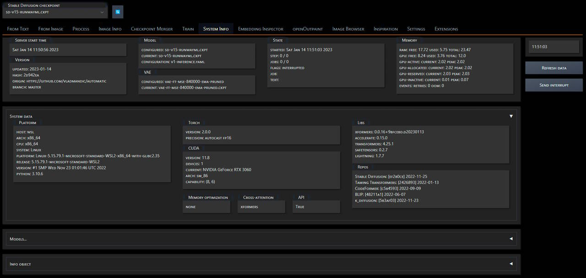
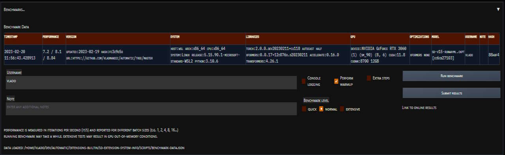

# System Info tab extensions for SD Automatic WebUI

Creates a top-level **System Info** tab in Automatic WebUI with

*Note*:

- State & memory info are auto-updated every second if tab is visible  
  (no updates are performed when tab is not visible)  
- All other information is updated once upon WebUI load and  
  can be force refreshed if required  

## Current information

- Server start time
- Version
- Current Model & VAE
- Current State
- Current Memory statistics

## System data

- Platform details
- Torch, CUDA and GPU details
- Active CMD flags such as `low-vram` or `med-vram`
- Versions of critical libraries as `xformers`, `transformers`, etc.
- Versions of dependent repositories such as `k-diffusion`, etc.

## Benchmark

- Allows to run standardized benchmark and optionally submit data to cloud logger [[details]](pages/README.md)

- *Note: Record is appended if any of the system properties change else benchmark data replaces existing matching record*

- All results can be [viewed online](https://vladmandic.github.io/sd-extension-system-info/pages/benchmark.html)

## Models

- Models (with hash)
- Hypernetworks
- Embeddings (including info on number of vectors per embedding)

  

## Info Object

- System object is available as JSON for quick passing of information

  
